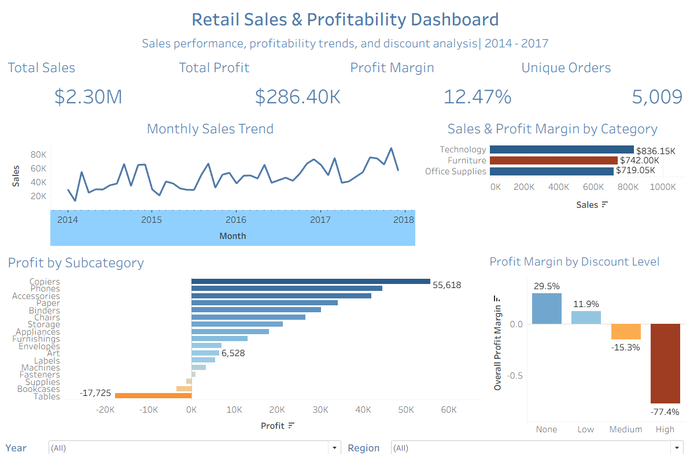

# Retail Sales & Profitability Analysis

## Project Overview

This project analyzes retail transaction data to evaluate overall sales and profitability performance and identify areas of strong and weak performance.

The analysis examines whether sales consistently translate into profits, where losses occur, which products and regions contribute most to performance, and how profitability varies across different discount levels. The goal is to identify areas that may require further investigation and support data-driven business decisions.

## Business Questions

1. What are the company's overall sales, profit, profit margin, and order volumes?
2. How have sales and profitability changed over time?
3. Which categories, subcategories, and products generate the strongest and weakest performance?
4. Are there high-sales areas that generate relatively little profit or losses?
5. How does profitability vary across regions and discount levels?
6. Which areas warrant further investigation based on the results?

## Dataset

The analysis uses the Tableau Sample Superstore dataset, containing **9,994 order-line records and 21 fields** covering the period from **2014 to 2017**.

The dataset includes information on customer orders, products, categories and subcategories, geographic regions, sales, quantities, discounts, and profits.

Each row represents an individual order line rather than a unique customer order. The dataset contains **5,009 unique orders**.

Initial data validation identified no missing values. Negative-profit transactions were retained because they represent meaningful business outcomes for profitability analysis rather than data-quality errors.

## Project Files

- [Excel Exploratory Analysis](superstore_excel_analysis.xlsx)
- [SQL Analysis](Superstore_analysis.sql)
- [Tableau Dashboard Image](retail_dashboard.png)

## Tools & Technologies

- **Microsoft Excel:** Data validation, exploratory analysis, PivotTables, calculated metrics, and initial identification of profitability patterns.
- **PostgreSQL / SQL:** Data querying, aggregation, KPI calculations, discount segmentation, year-over-year analysis, product ranking, and validation of analytical findings.
- **Tableau:** Interactive dashboard development, KPI visualization, profitability analysis, filters, tooltips, and dashboard actions.

### SQL Skills Demonstrated

`GROUP BY` • `WHERE` • `HAVING` • `CASE WHEN` • CTEs • `JOIN` • `COUNT(DISTINCT)` • `LAG()` • `RANK()` • `PARTITION BY` • Aggregate Functions • Window Functions

## Analytical Approach

1. **Data Understanding & Validation**  
   Reviewed the dataset structure, field types, missing values, value ranges, and transaction granularity. Confirmed that each record represented an individual order line.

2. **Exploratory Analysis**  
   Used Excel PivotTables and calculated metrics to explore sales and profitability across categories, subcategories, products, customers, segments, regions, discount levels, and time periods.

3. **SQL Analysis**  
   Used PostgreSQL to calculate business KPIs, investigate loss-making areas, segment transactions by discount level, analyze year-over-year performance, rank products within categories, and validate key findings.

4. **Visualization & Communication**  
   Built an interactive Tableau dashboard to communicate overall KPIs, monthly sales trends, category and subcategory profitability, and profitability across discount levels. Added Year and Region filters and category-level dashboard interactions.

## Interactive Dashboard

The Tableau dashboard provides an interactive view of overall sales performance, profitability trends, category and subcategory performance, and profitability across discount levels.

Users can filter the dashboard by **Year** and **Region** and select a product category to explore its underlying performance.

## Key Findings

### 1. Furniture generated strong sales but weak profitability

Furniture generated approximately **$742K in sales**, exceeding Office Supplies at approximately **$719K**. However, Furniture produced only about **$18.5K in profit**, resulting in a profit margin of approximately **2.49%**, compared with roughly **17%** for both Office Supplies and Technology.

### 2. Tables and Bookcases were the primary loss-making Furniture subcategories

Tables generated approximately **$207K in sales** but recorded a loss of approximately **$17.7K**, resulting in a profit margin of about **-8.56%**. Bookcases generated approximately **$115K in sales** but lost approximately **$3.5K**.

Outside Furniture, the Supplies subcategory also recorded an overall loss.

### 3. Higher discount levels were associated with weaker profitability

Transactions with no discount generated an overall profit margin of approximately **29.5%**, compared with **11.9%** for the low-discount group.

Profitability became negative for the medium- and high-discount groups, with margins of approximately **-15.3%** and **-77.4%**, respectively.

This relationship represents an association and does not establish that discounting alone caused the losses.

### 4. Sales recovered strongly after declining in 2015

Sales decreased approximately **2.83% in 2015**, before increasing **29.47% in 2016** and another **20.36% in 2017**.

Annual sales reached approximately **$733K in 2017**, the highest level during the four-year period.

### 5. Revenue growth outpaced profit growth in 2017

From 2016 to 2017, sales increased approximately **20.36%**, while profit increased only **14.24%**.

As a result, overall profit margin declined slightly from approximately **13.43% in 2016 to 12.74% in 2017**, indicating that revenue grew faster than profit.

## Business Recommendations

### 1. Investigate Furniture profitability

Review pricing, discounting, product costs, shipping costs, and product mix within the Furniture category, particularly **Tables and Bookcases**, to understand why substantial sales are not translating into stronger profitability.

### 2. Evaluate the discount strategy

Review medium- and high-discount transactions, which were associated with negative overall profit margins. Further analysis should determine whether the additional sales or quantities generated through discounting sufficiently compensate for the reduction in profitability.

### 3. Monitor profitable growth, not revenue alone

Sales growth should be evaluated alongside profit growth and profit margin. From 2016 to 2017, sales increased faster than profit, resulting in a slight decline in overall profit margin.

### 4. Review high-revenue, low-profit products

High sales should not automatically be interpreted as strong performance. Products and subcategories generating substantial revenue but low or negative profit should be reviewed for pricing, discounting, product costs, and sales mix before changes to promotions or product strategy are made.

## SQL Analysis

PostgreSQL was used to investigate the business questions in greater depth and validate findings from the exploratory analysis.

The SQL analysis includes:

1. Overall business KPI calculations
2. Category sales and profitability analysis
3. Furniture subcategory profitability
4. Tables profitability by discount level
5. Discount segmentation using `CASE WHEN`
6. Annual sales and profitability analysis
7. Year-over-year sales and profit growth using CTEs and `LAG()`
8. Top products within each category using `RANK()` and `PARTITION BY`
9. Regional analysis using a `JOIN`
10. High-revenue subcategory analysis using `HAVING`

### SQL Techniques

- Aggregate functions
- `GROUP BY`
- `WHERE`
- `HAVING`
- `CASE WHEN`
- Common Table Expressions (CTEs)
- `LAG()`
- Window functions
- `RANK()`
- `PARTITION BY`
- `COUNT(DISTINCT)`
- `JOIN`

> **Note:** A synthetic Region Manager lookup table was created solely to demonstrate SQL JOIN operations. The manager names are not part of the original Tableau Sample Superstore dataset.

## Conclusion

The analysis shows that revenue growth alone does not provide a complete picture of business performance. Although the company experienced strong sales growth and reached its highest annual sales in 2017, profitability varied considerably across categories, subcategories, and discount levels.

Furniture emerged as the clearest area for further investigation, particularly Tables and Bookcases. Higher discount levels were also associated with substantially weaker profit margins.

The findings suggest that future analysis should focus on product-level costs, pricing, shipping expenses, product mix, and the incremental sales generated by discounts before changes to pricing or discount policies are implemented.
